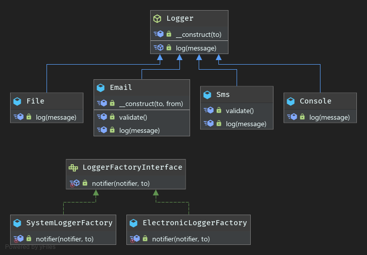

# Factory Method

**Gang of Four Definition**
```
"Define an interface for creating an object, but let subclasses decide which class to instantiate. 
The Factory method lets a class defer instantiation it uses to subclasses”
```

- The Factory Method differs from the ordinary Simple Factory on the basis that instead of having one factory, we can have many.
- The Factory Method allows you to group certain classes together and deal with them by means of an individual factory for a group of classes. 
  If you want to add another group, you can just add another factory.
- The factory method pattern differs from the abstract factory pattern. The abstract factory is used to create families of (sometimes vastly different) products, and the factory method is really concerned with creating a single varying product. Abstract factories often use factory methods.
- One drawback to this pattern is that sometimes it may be overkill for what you're trying to do. A more simplified/watered-down version of the factory method is called the simple factory.

### UML

 